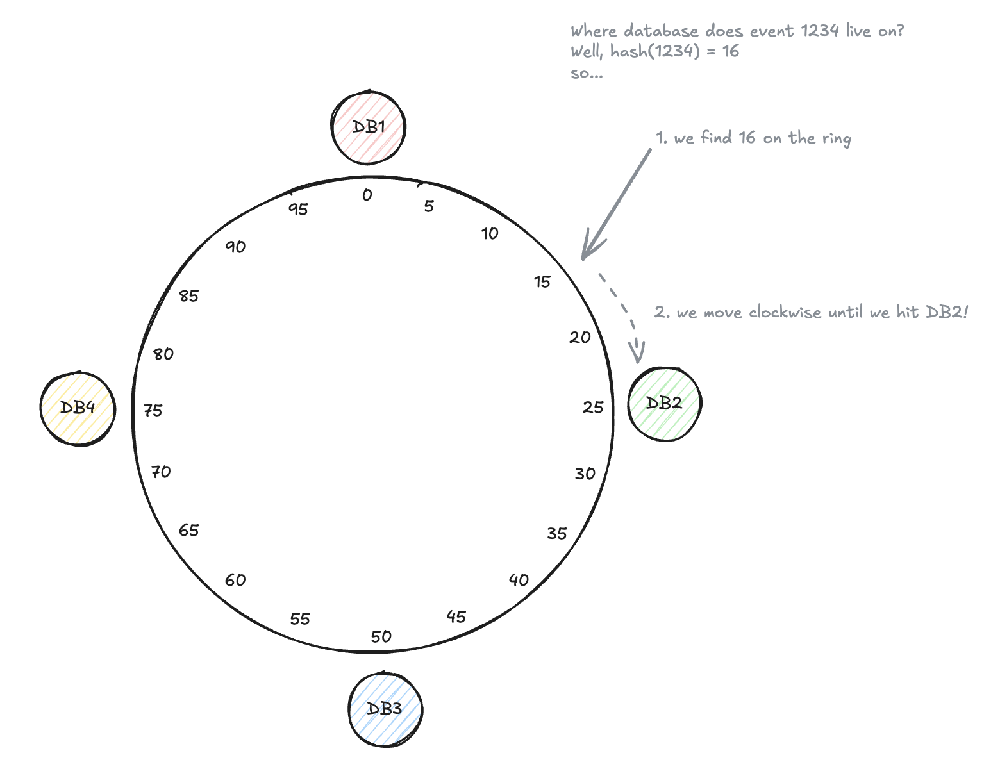

# Consistent Hashing

Consistent hashing solves a specific problem that comes up with distributed caches and sharded databases. When you use simple hash-based distribution (hash(key) % N to pick which server stores the data), adding or removing a server changes N. That means almost every key maps to a different server, so you'd have to move most of your data around. With millions of cache entries or database records, that's a disaster.

Consistent hashing fixes this by arranging both servers and keys on a virtual ring. You hash each key and place it on the ring, then the key belongs to the next server you encounter going clockwise. When you add a new server, only the keys between that new server and the previous server need to move. When you remove a server, only its keys relocate to the next server on the ring. Everything else stays put.

The improvement is massive. With simple modulo hashing, adding one server to a 10-server cluster means moving roughly 90% of your data. With consistent hashing, you only move about 10% (the keys that belonged to the affected range). This makes it practical to add and remove servers dynamically without causing a massive data migration.

This pattern shows up in several places. Distributed caches like Memcached and Redis Cluster use it to distribute keys across cache nodes. Distributed databases like Cassandra and DynamoDB use it for sharding. Some load balancers use it to assign requests to backend servers in a way that's stable when servers come and go. CDNs use it to route requests to edge servers.

> In interviews, you rarely need to explain how consistent hashing works unless specifically asked. It's enough to say "we'll use consistent hashing to distribute data across cache nodes" when you're talking about a distributed cache or "we'll use consistent hashing for the shard key" when discussing database sharding. The interviewer usually just wants to know you're aware of the technique.

The main time to bring it up is when you're discussing elastic scaling. If your system needs to add or remove cache nodes or database shards based on load, mention consistent hashing as the mechanism that makes this practical without massive data movement.