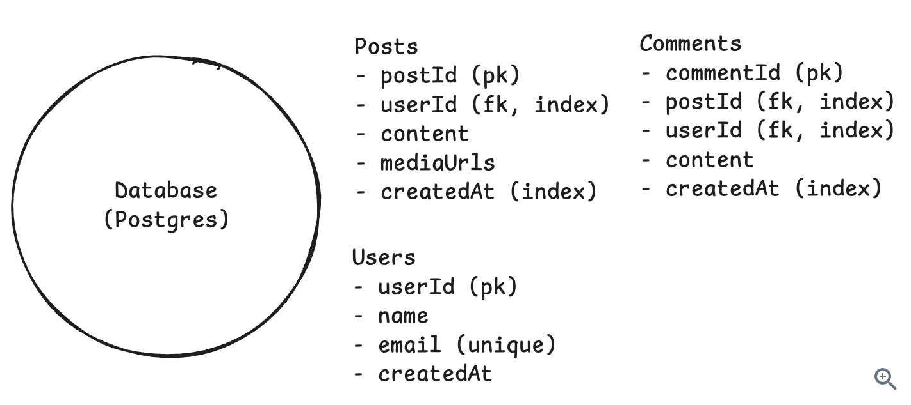

# Data Modeling

Data modeling is one of those things that sounds simple but has massive downstream effects on your system. The decisions you make about what data to store and how to structure it directly affect performance, scalability, and how painful it is to build and maintain your system.

The first big choice is relational versus NoSQL. Relational databases like Postgres work great when you have structured data with clear relationships and need strong consistency. Things like user accounts linking to orders linking to products. You can express complex queries with SQL, use transactions to keep data consistent, and enforce foreign key constraints. NoSQL databases like DynamoDB or MongoDB shine when you need flexible schemas (your data structure changes frequently) or you need to scale horizontally across many servers without complex joins.

Within relational databases, you'll hear about normalization and denormalization. Normalization means splitting data across tables to avoid duplication. You have a users table, an orders table, and a products table. Each order references a user ID and product ID instead of copying the full user and product data into every order record. This keeps your data consistent (update a product name once and it's updated everywhere), but it means you need joins to get complete data. Joins get expensive when your tables are huge or you're joining across multiple tables.

Denormalization goes the other way. You duplicate data to avoid joins and make reads faster. Instead of joining to the users table every time you display an order, you store the username directly in each order record. Now you can fetch an order and display it without touching another table. The downside is updates. If a user changes their name, you have to update it in the users table plus every order record that copied it. For read-heavy systems where data rarely changes, this tradeoff is often worth it.

> In interviews, a safe default is to start with a normalized relational model and then denormalize specific hot paths if you identify read performance issues. Don't propose denormalization upfront unless you have a clear reason. Interviewers want to see that you understand the tradeoffs, not that you blindly apply techniques.

NoSQL databases force you to think differently. DynamoDB requires you to design your partition key and sort key based on your access patterns. If you're building a social media app and your most common query is "get all posts for user X," you'd use user_id as the partition key. This makes that query a fast single-partition lookup. But now queries like "get all posts mentioning hashtag Y" require scanning the entire table because you didn't design for that access pattern. You have to know your queries upfront and design around them.
