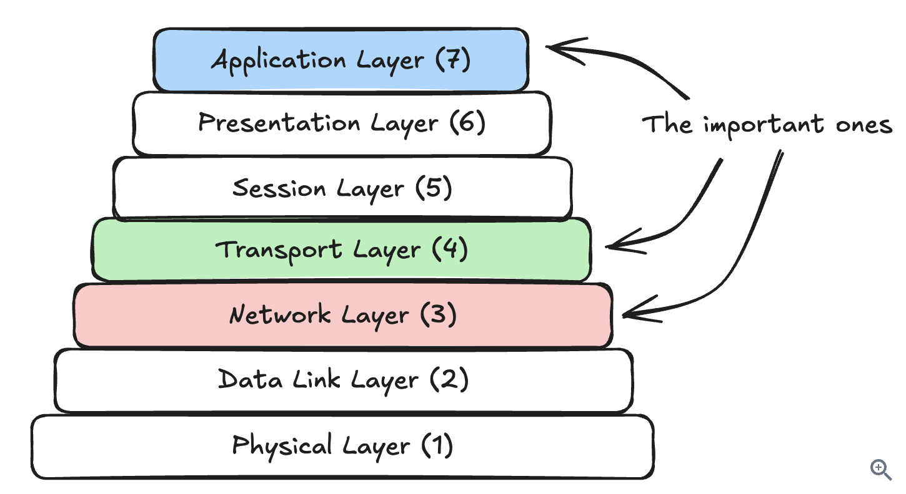

Core concepts are the fundamental principles and techniques that form the foundation of every system design interview. Unlike specific technologies (Redis, Kafka) or problem-specific patterns, these are technology-agnostic building blocks that show up across nearly every design problem you'll encounter.

# Networking Essentials
Networking is one of those topics where you can go incredibly deep, but for system design interviews you need to know the practical bits that come up when you're designing distributed systems. At a basic level, you need to understand how services talk to each other and what happens when those connections fail or get slow.
The most important decision you'll make is choosing your communication protocol. For most systems, you'll default to HTTP over TCP. It's well-understood, works everywhere, and handles 90% of use cases. Your interviewer will expect this unless you have a specific reason to use something else.

WebSockets and Server-Sent Events (SSE) come up when you need real-time updates. The key difference: SSE is for server-to-client push only (like live scores or notifications), while WebSockets handle bidirectional communication where both sides send messages (like chat or live collaboration). SSE is simpler to implement and works better with standard HTTP infrastructure, but WebSockets are necessary when clients need to push data back to the server frequently. Learn more about different approaches in our Realtime Updates pattern guide.

Both are stateful connections, which means you can't just throw them behind a standard load balancer. You'll need to think about connection persistence and what happens when a server goes down with thousands of active connections.
gRPC is worth mentioning for internal service-to-service communication when performance is critical. It uses binary serialization and HTTP/2, making it significantly faster than JSON over HTTP. But you won't use it for public-facing APIs because browser support is limited. A common pattern is REST for external APIs and gRPC internally.

Load balancing is another area interviewers love to probe. Layer 7 load balancers operate at the application level and can route based on the actual HTTP request content. You can send API calls to one service and web page requests to another. Layer 4 load balancers work at the TCP level and are faster but dumber. They just distribute connections without looking at the content. For WebSockets, you typically need Layer 4 balancing because you're maintaining a persistent TCP connection.

> A common mistake is proposing WebSockets when HTTP with long polling or Server-Sent Events would work fine. WebSockets add significant complexity for maintaining stateful connections at scale. Only reach for them when you genuinely need bidirectional real-time communication, not just because "real-time" is mentioned in the problem.

Geography and latency matter more than most candidates realize. A request from New York to London has a minimum latency of around 80ms just from the speed of light through fiber optic cables, before you even process anything. If your system needs low latency globally, you'll need regional deployments with data replicated or partitioned by geography. This is why CDNs exist - to serve static content from edge servers close to users.

