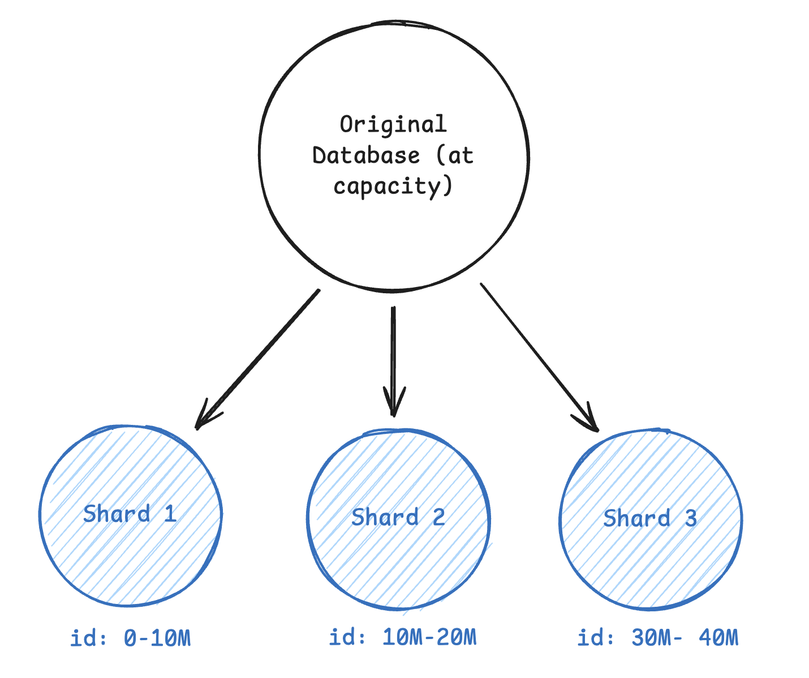

# Sharding

Sharding comes up when you've outgrown a single database and need to split your data across multiple independent servers. This happens when you hit storage limits (a single Postgres instance maxes out around a few TB), write throughput limits (tens of thousands of writes per second), or read throughput that even replicas can't handle.

The most important decision is your shard key. This determines how data gets distributed and affects everything else in your design. For a user-centric app like Instagram, sharding by user_id means all of a user's posts, likes, and comments live on one shard. User-scoped queries are fast because they only hit one shard. But now global queries like "trending posts across all users" become expensive because you have to hit every shard and aggregate results. That's the tradeoff.

Most systems use hash-based sharding where you hash the shard key and use modulo to pick a shard. This distributes data evenly and avoids hot spots. Range-based sharding can work if your access patterns naturally partition (like multi-tenant SaaS where each company only queries their own data), but it's easy to create hot spots if one range gets more traffic. Directory-based sharding uses a lookup table to decide where data lives. It's flexible but adds a dependency and latency to every request, so it's rarely worth it in interviews.

> The biggest mistake with sharding is doing it too early. A well-tuned single database with read replicas can handle way more than most candidates think. Before you propose sharding, do the capacity math. If you're at 10K writes per second and 100GB of data, you don't need sharding yet. Bring it up when the numbers justify it, not as a default scaling strategy.

Sharding creates new problems you need to address. Cross-shard transactions become nearly impossible, so you need to design your shard boundaries to avoid them. If a user transfer in your banking app requires updating accounts on different shards, you'll need distributed transactions or sagas, which are complex and slow. Hot spots happen when one shard gets disproportionate traffic (think Taylor Swift's shard getting hammered while others sit idle). And resharding is painful. You can't just add a new shard without moving massive amounts of data around.

In interviews, bring up sharding after you've justified why a single database won't work. Then clearly state your shard key choice and explain the tradeoff (fast for X queries, slow for Y queries). That's all most interviewers need to see.
