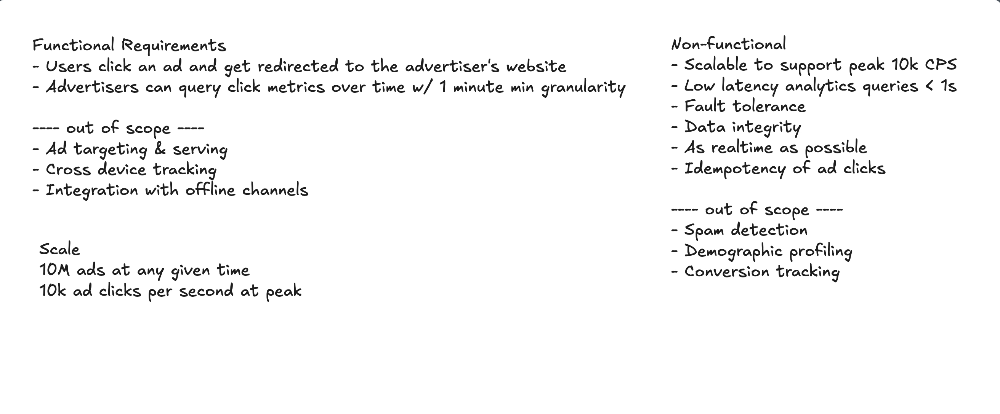
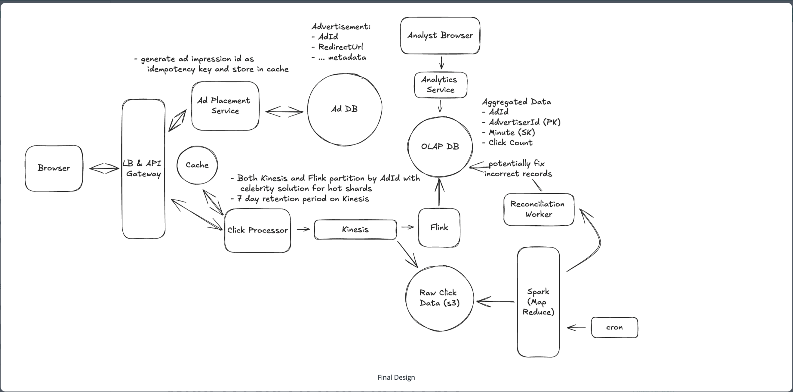

https://www.hellointerview.com/learn/system-design/problem-breakdowns/ad-click-aggregator

# Ad Click Aggregator

## Understanding the Problem

An Ad Click Aggregator is a system that collects and aggregates data on ad clicks. It is used by advertisers to track the performance of their ads and optimize their campaigns. For our purposes, we will assume these are ads displayed on a website or app, like Facebook.

## Requirements

### Functional Requirements

- Users can click on an ad and be redirected to the advertiser's website.
- Advertisers can query ad click metrics over time with a minimum granularity of 1 minute.

##### Out of scope
- Ad targeting
- Ad serving
- Cross device tracking
- Integration with offline marketing channels

### Non-Functional Requirements

> Before we jump into our non-functional requirements, it's important to ask your interviewer about the scale of the system. For this design in particular, the scale will have a large impact on the database design and the overall architecture.
> 
> We are going to design for a system that has 10M active ads and a peak of 10k clicks per second. The total number of clicks per day will be around 100M.
> With that in mind, let's document the non-functional requirements.

- Scalable to support a peak of 10k clicks per second
- Low latency analytics queries for advertisers (sub-second response time)
- Fault tolerant and accurate data collection.
- As real-time as possible. Advertisers should be able to query data as soon as possible after the click.
- Idempotent click tracking. We should not count the same click multiple times.

## System Interface
For data processing questions like this one, it helps to start by defining the system's interface. This includes clearly outline what data the system receives and what it outputs, establishing a clear boundary of the system's functionality. The inputs and outputs of this system are very simple, but it's important to get these right!

- Input: Ad click data from users.
- Output: Ad click metrics for advertisers.

## Data Flow
The data flow is the sequential series of steps we'll cover in order to get from the inputs to our system to the outputs. Clarifying this flow early will help to align with our interviewer before the high-level design. For the ad click aggregator:
1. User clicks on an ad on a website.
2. The click is tracked and stored in the system.
3. The user is redirected to the advertiser's website.
4. Advertisers query the system for aggregated click metrics.

> Note that this is simple, we will improve upon as we go, but it's important to start simple and build up from there.

## High-Level Design

### 1) Users can click on ads and be redirected to the target

Let's start with the easy part, when a user clicks on an ad in their browser, we need to make sure that they're redirected to the advertiser's website. We'll introduce a Ad Placement Service which will be responsible for placing ads on the website and associating them with the correct redirect URL.

When a user clicks on an ad which was placed by the Ad Placement Service, we will send a request to our /click endpoint, which will track the click and then redirect the user to the advertiser's website.

There are two ways we can handle this redirect, with one being simpler and the other being more robust.

#### Good Solution: Client-side Redirect

**Approach**

The simplest thing we can do is send over a redirect URL with each ad that's placed on the website. When a user clicks on the ad, the browser will automatically redirect them to the target URL. It's simple, straightforward, and requires no additional server side logic. We would then, in parallel, POST to our /click endpoint to track the click.

**Challenges**

The downside with this approach is that users could go to an advertiser's website without us knowing about it. This could lead to discrepancies in our click data and make it harder for advertisers to track the performance of their ads. Sophisticated users could grab the url off of the page and navigate to it directly, bypassing our click tracking entirely. Someone would probably build a browser extension to do this.

#### Great Solution: Server-side Redirect

**Approach**

A more robust solution is to have the user click on the ad, which will then send a request to our server. Our server can then track the click and respond with a redirect to the advertiser's website via a 302 (redirect) status code.

This way, we can ensure that we track every click and provide a consistent experience for users and advertisers. This approach also allows us to append additional tracking parameters to the URL, which can help the advertiser track the source of the click, but this is out of scope so we won't go into more detail here.

**Challenges**

The only downside is the added complexity, which could slow down the user experience. We need to make sure that our system can handle the additional load and respond quickly to the user's request.

### 2) Advertisers can query ad click metrics over time at 1 minute intervals

Our users were successfully redirected, now let's focus on the advertisers. They need to be able to quickly query metrics about their ads to see how they're performing. We'll expand on the click processor path that we introduced above by breaking down some options for how a click is processed and stored.

Once our /click endpoint receives a request what happens next?

#### Bad Solution: Store and Retrieve in the same DB

When a click comes in from a user, we can simply store that click event in our database. Frankly, at our scale, this solution sucks. The database will quickly become a bottleneck as we scale up to 10k clicks per second. The GROUP BY query will be slow and inefficient, and we won't be able to provide low latency queries to advertisers -- breaking our non-functional requirement.

#### Good Solution: Separate Analytics Database with Batch Processing

**Approach**

A better solution is to have a separate analytics database that stores pre-aggregated data. When a click comes in, we will store the raw event in our event database. Then, in batches, we can process the raw events and aggregate them into a separate database that is special optimized for querying.

When an advertiser wants to query metrics, we simply query this analytics database for the metrics that they need. This allows us to provide low latency queries since we did the expensive aggregation work in advance.

To pull this off, we'll need an event database that is optimized for lots of writes. Cassandra is a good choice here. It uses a storage structure that resembles LSM. It writes inserts and updates in a log-like structure known as a memtable (in memory) and periodically flushes these memtables to disk in files called SSTables. These SSTable, while optimized for reads of specific rows, are not optimized for range queries or aggregations which is why we need to do the batch processing to pre-aggregate.

In order to do the batch processing, we can use a tool like Apache Spark. Spark is a distributed computing engine that is optimized for these types of workflows and can handle the large volume of data that we will be processing.

How much data will we be processing exactly?

Well, if we have 10k clicks per second and we choose to run our batch processing every 5 minutes, we will be processing 3M events every batch. Each event will only be a hundred bytes at most, so we will be processing 300MB of data every batch. This is well within the capabilities of Spark.

Using map-reduce, Spark will read the raw events in parallel chunks, aggregate them by ad ID and minute timestamp, and then write the aggregated data to our analytics database.

For an analytics database, we want a technology that is optimized for reads and aggregations. Online analytical processing (OLAP) databases like Redshift, Snowflake, or BigQuery are all good choices here. They are optimized for these types of queries and can handle the large volume of data that we will be storing.

1. The ad click is sent to the click processor service.
2. The click processor service writes the event to our event store.
3. Every N minutes, a cron job kicks off a spark job that reads the events from the event store and aggregates them.
4. The aggregated data is stored in an OLAP database for querying.
5. Advertisers can query the OLAP database to get metrics on their ads.

**Challenges**

This solution works, and it works pretty well, but there are several key challenges that prevent it from being a "great" solution. First, the batched processing job introduces a significant delay in the data pipeline. Advertisers will always be querying data that is at a couple minutes old. This is not ideal and something we can improve upon. Second, the system is not scalable. If we have a sudden spike in clicks, the system will not be able to handle the load.

While the simple inclusion of a queue between the click processor and the event store would help with the scalability issue, it would not solve the latency problem. To address both of these challenges, we can introduce a stream processing design that processes events in real-time.

#### Great Solution: Real-time Analytics with Stream Processing

**Approach**

o address the latency and scalability issues, let's introduce a stream for real-time processing. This system allows us to process events as they come in, rather than waiting for a batch job to run.

When a click comes in our click processing service will immediately write the event to a stream like Kafka or Kinesis. We then need a stream processor like Flink or Spark Streaming to read the events from the stream and aggregate them in real-time.

This works by keeping a running count of click totals in memory and updating them as new events come in. When we reach the end of a time window, we can flush the aggregated data to our OLAP database.

Now, when a click comes in:
1. The click processor service writes the event to a stream like Kafka or Kinesis.
2. A stream processor like Flink or Spark Streaming reads the events from the stream and aggregates them in real-time.
3. The aggregated data is stored in our OLAP database for querying.
4. Advertisers can query the OLAP database to get metrics on their ads in near real-time.

**Challenges**

Astute readers may recognize that the latency from click to query between this solution and the "good" solution is not all that different depending on what aggregation window we choose for Flink and how often we run Spark jobs. If we aggregate on minute boundaries and also run our Spark jobs every minute, the latency is about the same (just slightly higher for the batch processing solution due to the time it takes to run the Spark job). That said, we have levers to play with. It's much more realistic for us to decrease the Flink aggregation window than it is for us to increase the Spark job frequency given the overhead of running Spark jobs. This means we could aggregate clicks every couple of seconds with this streaming approach to decrease latency, while we'd be hard-pressed to run Spark jobs every couple of seconds.

Even better, Flink has flush intervals that can be configured, so we can aggregate on a minute boundary but flush the results every couple of seconds. This way, we get the best of both worlds, and the latest minute's data will just be incomplete until the minute boundary is reached, which would be the expected behavior.

### Interview Questions

#### 1) How can we scale to support 10k clicks per second?

Let's walk through each bottleneck the system could face from the moment a click is captured and how we can overcome it:

**Click Processor Service:** We can easily scale this service horizontally by adding more instances. Most modern cloud providers like AWS, Azure, and GCP provide managed services that automatically scale services based on CPU or memory usage. We'll need a load balancer in front of the service to distribute the load across instances.

**Stream:** Both Kafka and Kinesis are distributed and can handle a large number of events per second but need to be properly configured. Kinesis, for example, has a limit of 1MB/s or 1000 records/s per shard, so we'll need to add some sharding. Sharding by AdId is a natural choice, this way, the stream processor can read from multiple shards in parallel since they will be independent of each other (all events for a given AdId will be in the same shard).

**Stream Processor:** The stream processor, like Flink, can also be scaled horizontally by adding more tasks or jobs. We'll have a seperate Flink job reading from each shard doing the aggregation for the AdIds in that shard.

**OLAP Database:** The OLAP database can be scaled horizontally by adding more nodes. While we could shard by AdId, we may also consider sharding by AdvertiserId instead. In doing so, all the data for a given advertiser will be on the same node, making queries for that advertiser's ads faster. This is in anticipation of advertisers querying for all of their active ads in a single view. Of course, it's important to monitor the database and query performance to ensure that it's meeting the SLAs and adapting the sharding strategy as needed.

**Hot Shards** 

With the above scaling strategies, we should be able to handle a peak of 10k clicks per second. There is just one remaining issue, hot shards. Consider the case where Nike just launched a new Ad with Lebron James. This Ad is getting a lot of clicks and all of them are going to the same shard. This shard is now overwhelmed, which increases latency and, in the worst case, could even cause data loss.
To solve the hot shard problem, we need a way of further partitioning the data. One popular approach is to update the partition key by appending a random number to the AdId. We could do this only for the popular ads as determined by ad spend or previous click volume. This way, the partition key becomes AdId:0-N where N is the number of additional partitions for that AdId.

#### 2) How can we ensure that we don't lose any click data?

The first thing to note is that we are already using a stream like Kafka or Kinesis to store the click data. By default, these streams are distributed, fault-tolerant, and highly available. They replicate data across multiple nodes and data centers, so even if a node goes down, the data is not lost. Importantly for our system, they also allow us to enable persistent storage, so even if the data is consumed by the stream processor, it is still stored in the stream for a certain period of time.

We can configure a retention period of 7 days, for example, so that if, for some reason, our stream processor goes down, it will come back up and can read the data that it lost from the stream again.

Stream processors like Flink also have a feature called checkpointing. This is where the processor periodically writes its state to a persistent storage like S3. If it goes down, it can read the last checkpoint and resume processing from where it left off. This is particularly useful when the aggregation windows are large, like a day or a week. You can imagine we have a weeks worth of data in memory being aggregated and if the processor goes down, we don't want to lose all that work.

For our case, however, our aggregation windows are very small. Candidates often propose using checkpointing when I ask this question in interview, but I'll usually push back and ask if it really makes sense given the small aggregation windows. If Flink were to go down, we would have lost, at most, a minutes worth of aggregated data. Given persistence is enabled on the stream, we can just read the lost click events from the stream again and re-aggregate them.

These types of identifications that somewhat go against the grain are really effective ways to show seniority. A well-studied candidate may remember reading about checkpointing and propose it as a solution, but an experienced candidate will instead think critically about whether it's actually necessary given the context of the problem.

**Reconciliation**

Click data matters, a lot. If we lose click data, we lose money. So we need to make sure that our data is correct. This is a tough balance, because guaranteeing correctness and low latency are often at odds. We can balance the two by introducing periodic reconciliation.
Despite our best efforts with the above measures, things could still go wrong. Transient processing errors in Flink, bad code pushes, out-of-order events in the stream, etc., could all lead to slight inaccuracies in our data. To catch these, we can introduce a periodic reconciliation job that runs every hour or day.
At the end of the stream, alongside the stream processors, we can also dump the raw click events to a data lake like S3. Flink supports this through its FileSystem interface and various connectors, allowing for both batch and real-time data processing outputs to be stored directly in S3 buckets. Then, as with the "good" answer in "Advertisers can query ad click metrics over time at 1-minute intervals" above, we can run a batch job that reads all the raw click events from the data lake and re-aggregates them. This way, we can compare the results of the batch job to the results of the stream processor and ensure that they match. If they don't, we can investigate the discrepancies and fix the root cause while updating the data in the OLAP DB with the correct values.

**Reconciliation**

This essentially combines our two solutions, real-time stream processing and periodic batch processing, to ensure that our data is not only fast but also accurate.

#### 3) How can we prevent abuse from users clicking on ads multiple times?

While modern systems have advanced fraud detection systems, which we have considered out of scope, we still want to come up with a way to enforce ad click idempotency. ie. if a user clicks on an ad multiple times, we only count it as one click.

Let's breakdown a couple of ways to do this:

**Good Solution**

##### Approach

One simple way to do this is requiring users to be logged in before they can see an ad. This method logs their userId, which would be extracted from the JWT token or session cookie, alongside the click data. We could then dedup our clicks based on the combination of userId and adId.
Importantly, the dedupping would need to be done before the click data is put into the stream. This is because we need to dedup across aggregation windows. If a duplicate click comes in on either side of a minute boundary, it will be counted as two clicks.

##### Challenges

This approach has some serious limitations. First, it requires that all users are logged in, which may not always be the case (granted, this is a product decision to discuss with your interviewer). Second, it makes sure that we count only one click for any given user clicking on any given ad, but this would not actually be what we want.
Consider retargeting, where we intentionally show the same ad to the same user multiple times over an extended period. We need to amend our problem statement to say that we only count one click per user per ad instance. This is a subtle but important distinction, and our current solution does not account for it.

**Great Solution:**

##### Approach
The better approach is to have the Ad Placement Service generate a unique impression ID for each ad instance shown to the user. This impression ID would be sent to the browser along with the ad and will serve as an idempotency key. When the user clicks on the ad, the browser sends the impression ID along with the click data. This way we can dedup clicks based on the impression ID.

Let's recap:
1. Ad Placement Service generates a unique impression ID for each ad instance shown to the user.
2. The impression ID is signed with a secret key and sent to the browser along with the ad.
3. When the user clicks on the ad, the browser sends the impression ID along with the click data.
4. The Click Processor verifies the signature of the impression ID.
5. The Click Processor checks if the impression ID exists in a cache. If it does, then it's a duplicate, and we ignore it. If it doesn't, then we put the click in the stream and add the impression ID to the cache.

##### Challenges

This solution is not without its challenges. We've added complexity, and the cache could potentially become a bottleneck if not properly scaled. That said, it's worth noting that the cache data should be relatively small. With 100 million per day, if these were all unique impressions, then that's only 100 million * 16 bytes (128 bits) = 1.6 GB. Tiny.
Regardless, we can easily play it safe by using a distributed cache like Redis Cluster or Memcached to scale. In the event the cache goes down, we would handle this by having a replica of the cache that could take over and by enabling cache persistence so the cache data is not lost.

#### 4) How can we ensure that advertisers can query metrics at low latency?

This was largely solved by the pre-processing of the data in real-time. Whether using the "good" solution with periodic batch processing or the "great" solution with real-time stream processing, the data is already aggregated and stored in the OLAP database making the queries fast.

Where this query can still be slow is when we are aggregating over larger time windows, like a days, weeks, or even years. In this case, we can pre-aggregate the data in the OLAP database. This can be done by creating a new table that stores the aggregated data at a higher level of granularity, like daily or weekly. This can be via a nightly cron job that runs a query to aggregate the data and store it in the new table. When an advertiser queries the data, they can query the pre-aggregated table for the higher level of granularity and then drill down to the lower level of granularity if needed.

> Pre-aggregating the data in the OLAP database is a common technique to improve query performance. It can be thought of similar to a form of caching. We are trading off storage space for query performance for the most common queries.

## Final Design
Putting it all together, one final design could look like this:
