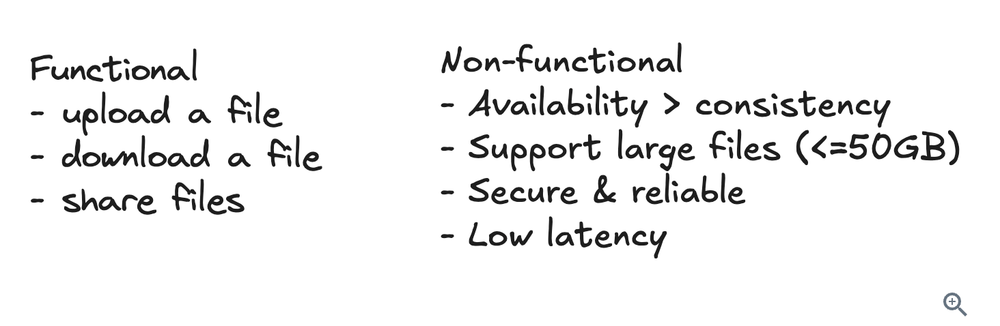
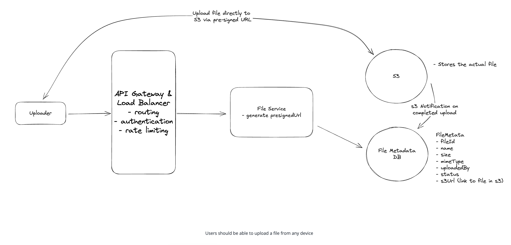
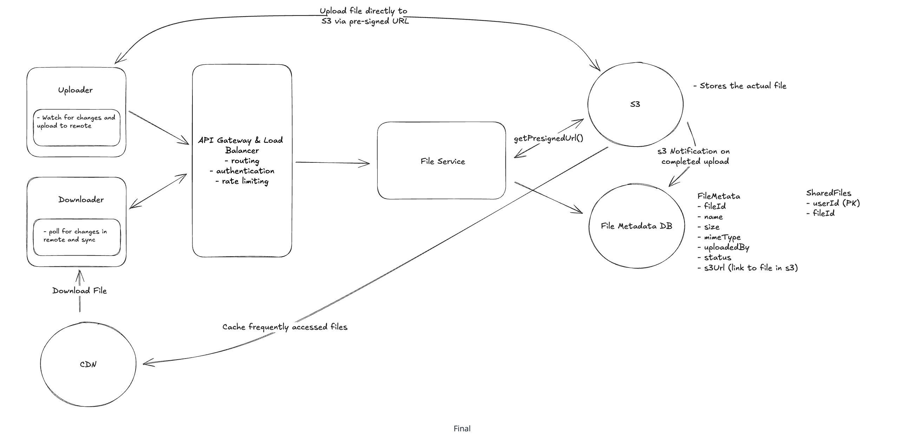

# Designing Cloud Object Store like DropBox

Dropbox is a cloud-based file storage service that allows users to store and share files. It provides a secure and reliable way to store and access files from anywhere, on any device.

# Requirements



## Functional Requirements

### Core Requirements
- Users should be able to upload a file from any device
- Users should be able to download a file from any device
- Users should be able to share a file with other users and view the files shared with them
- Users can automatically sync files across devices

### Below the line (out of scope):
- Users should be able to edit files
- Users should be able to view files without downloading them

## Non-Functional Requirements

### Core Requirements
- The system should be highly available (prioritizing availability over consistency).
- The system should support files as large as 50GB.
- The system should be secure and reliable. We should be able to recover files if they are lost or corrupted.
- The system should make upload, download, and sync times as fast as possible (low latency).

### Below the line (out of scope):
- The system should have a storage limit per user
- The system should support file versioning
- The system should scan files for viruses and malware

# Core Entities

For Dropbox, the primary entities are incredibly straightforward:

- File: This is the raw data that users will be uploading, downloading, and sharing.
- FileMetadata: This is the metadata associated with the file. It will include information like the file's name, size, mime type, and the user who uploaded it.
- User: The user of our system.

# API or System Interface

1. Starting with uploading a file, we might have an endpoint like this:

    ```
    POST /files
    Request:
    {
    File, 
    FileMetadata
    }
    ```

2. To download a file, our endpoint can be:
   ```
    GET /files/{fileId} -> File & FileMetadata
   ```

3. To share a file, we might have an endpoint like this:
   ```
    POST /files/{fileId}/share
    Request:
    {
    User[] // The users to share the file with
    }
   ```

4. Lastly, we need a way for clients to query for changes to files on the remote server. This way we know which files need to be synced to the local device.
   ```
    GET /files/{fileId}/changes -> FileMetadata[]
   ```

# High-Level Design

## 1) Users should be able to upload a file from any device

The main requirement for a system like Dropbox is to allow users to upload files. When it comes to storing a file, we need to consider two things:

- Where do we store the file contents (the raw bytes)?
- Where do we store the file metadata?

For the metadata, we can use a NoSQL database like DynamoDB. DynamoDB is a fully managed NoSQL database hosted by AWS. Our metadata is loosely structured, with few relations and the main query pattern being to fetch files by user. This makes DynamoDB a solid choice, but don't get too caught up in making the right choice here in your interview. 

Our schema will be a simple document and can start with something like this:
```
  {
    "id": "123",
    "name": "file.txt",
    "size": 1000,
    "mimeType": "text/plain",
    "uploadedBy": "user1"
  }
```
As for how we store the file itself, we have a few options. Let's take a look at the trade-offs of each.

### Good Design: Upload to Blob Storage

**Approach**

A better approach is to store the file in a Blob Storage service like Amazon S3 or Google Cloud Storage. When a user uploads a file to our backend, we can send the file directly to Blob Storage and store the metadata in our database. We can store a (virtually) unlimited number of files in Blob Storage as it will handle the scaling for us. It's also more reliable. If our server goes down, we don't lose access to our files. We can also take advantage of Blob Storage features like lifecycle policies to automatically delete old files and versioning to keep track of file changes if needed (though this is out of scope for this problem).

**Challenges**

One challenge with this approach is that it's more complex. We need to integrate with the Blob Storage service and handle the case where the file is uploaded but the metadata is not saved. We also need to handle the case where the metadata is saved but the file is not uploaded. We can solve these issues by using a transactional approach where we only save the metadata if the file is successfully uploaded and vice versa.
Second, this approach (as depicted above) requires that we technically upload a file twice -- once to our backend and once to Blob Storage. This is redundant. We can solve this issue by allowing the user to upload the file directly to the Blob Storage service.

### Great Design: Upload Directly to Blob Storage



**Approach**

The best approach is to allow the user to upload the file directly to Blob Storage from the client. This is faster and cheaper than uploading the file to our backend first. We can use presigned URLs to generate a URL that the user can use to upload the file directly to the Blob Storage service. Once the file is uploaded, the Blob Storage service will send a notification to our backend so we can save the metadata.

Presigned URLs are URLs that give the user permission to upload a file to a specific location in the Blob Storage service. We can generate a presigned URL and send it to the user when they want to upload a file. So whereas our initial API for upload was a POST to /files, it will now be a three step process:

1. Request a pre-signed URL from our backend (which generates the URL using the S3 SDK) and save the file metadata in our database with a status of "uploading."
   ```
    POST /files/presigned-url -> PresignedUrl
    Request:
    {
    FileMetadata
    }
    ```

2. Use the presigned URL to upload the file to Blob Storage directly from the client. This is via a PUT request directly to the presigned URL where the file is the body of the request.

3. Once the file is uploaded, the Blob Storage service will send a notification to our backend using S3 Notifications. Our backend will then update the file metadata in our database with a status of "uploaded".

## 2) Users should be able to download a file from any device

The next step is making sure users can download their saved files. Just like with uploads, there are a few different ways to approach this.

### Good Design: Download from Blob Storage

**Approach**

A better approach is to allow the user to download the file directly from Blob Storage. We can use presigned URLs to generate a URL that the user can use to download the file directly from Blob Storage. Like with uploading, the presigned url will give the user permission to download the file from a specific location in the Blob Storage service for a limited time.

1. Request a presigned download URL from our backend
`GET /files/{fileId}/presigned-url -> PresignedUrl`

2. Use the presigned URL to download the file from the Blob Storage service directly to the client.

**Challenges**

While nearly optimal, the main limitation is that this can still be slow for a large, geographically distributed user base. Your Blob Storage is located in a single region, so users far away from that region will have slower download times. We can solve this issue by using a content delivery network (CDN) to cache the file closer to the user.

### Great Design: Download from CDN

**Approach**

The best approach is to use a content delivery network (CDN) to cache the file closer to the user. A CDN is a network of servers distributed across the globe that cache files and serve them to users from the server closest to them. This reduces latency and speeds up download times.
When a user requests a file, we can use the CDN to serve the file from the server closest to the user. This is much faster than serving the file from our backend or the Blob Storage service.

For security, just like with our S3 presigned URLs, we can generate a URL that the user can use to download the file from the CDN. This URL will give the user permission to download the file from a specific location in the CDN for a limited time. More on this in our deep dives on security.

**Challenges**

CDNs are relatively expensive. To address this, it is common to be strategic about what files are cached and for how long. We can use a cache control header to specify how long the file should be cached in the CDN. We can also use a cache invalidation mechanism to remove files from the CDN when they are updated or deleted. This way, only files that are frequently accessed are cached and we don't waste money caching files that are rarely accessed.

## 3) Users should be able to share a file with other users

To round out the functional requirements, we need to support sharing files with other users. We will implement this similarly to Google Drive, where you just need to enter the email address of the user you want to share the file with. We can assume users are already authenticated.

The main consideration here in an interview is how you can make this process fast and efficient. Let's break it down.

### Bad Design: Add a ShareList to Metadata

**Approach**

A good start is to simply add a list of users who have access to the file directly to the file metadata. When a user shares a file, we can add the user to the list. When a user downloads a file, we can check if they are in the list. This is a simple and effective approach.
```
{
  "id": "123",
  "name": "file.txt",
  "size": 1000,
  "mimeType": "text/plain",
  "uploadedBy": "user1",
  "sharelist": ["user2", "user3"]
}
```

**Challenges**

When a user opens our site they expect to see a list of all of their files and files that have been shared with them. Getting the list of their files is easy, especially since we will have uploadedBy as the primary key. But getting the list of files shared with them is slow with this approach. We would need to scan the sharelist of every file to see if the user is in it.

### Good Design: Caching to Speed Up fetching the ShareList

**Approach**

A better approach is, in addition to the sharelist in the file metadata, to cache a list that maps the inverse relationship. This would be a mapping from any given user to the list of files shared with them. This way, when a user opens our site, we can quickly get the list of files shared with them by looking up their userId in our sharedFiles cache.

Our cache entry would be a simple key-value pair like this:
`user1:["fileId1", "fileId2"]`

**Challenges**

We need to keep the sharedFiles list in sync with the sharelist in the file metadata. The best way to overcome this would be to just keep this user to file list mapping in the same database and update both the sharelist and sharedFiles list in a transaction.

### Great Design: Create a Separate Table for Shares

**Approach**

Another approach is to fully normalize the data. This would involve creating a new table that maps userId to fileId, where fileId is a file shared with the given user. This way, when a user opens our site, we can quickly get the list of files shared with them by querying the SharedFiles table for all of the files with a userId of the user.

So you would create a new table, SharedFiles, that looks like this:
```
| userId (PK) | fileId (SK) |
| ----------- | ----------- |
| user1       | fileId1     |
| user1       | fileId2     |
| user2       | fileId3     |
```

In this design, we no longer need the sharelist in the file metadata. We can simply query the SharedFiles table for all of the files that have a userId matching the requesting user, removing the need to keep the sharelist in sync with the sharedFiles list.

**Challenges**

This query is slightly less efficient than the previous approach since now we query using an index instead of a simple key-value lookup. However, the tradeoff may be worth it since we no longer need to keep the sharelist in sync with the sharedFiles list.

## 4) Users can automatically sync files across devices

Last up, we need to make sure that files are automatically synced across different devices. At a high level, this works by keeping a copy of a particular file on each client device (locally) and also in remote storage (i.e., the "cloud"). As such, there are two directions we need to sync in:

```
Local -> Remote
Remote -> Local
```

### Local -> Remote
When a user updates a file on their local machine, we need to sync these changes with the remote server. We consider the remote server to be the source of truth, so it's important that we get it consistent as soon as possible so that other local devices can know when there are changes they should pull in.

To do this, we need a client-side sync agent that:
1. Monitors the local Dropbox folder for changes using OS-specific file system events (like FileSystemWatcher on Windows or FSEvents on macOS)
2. When it detects a change, it queues the modified file for upload locally
3. It then uses our upload API to send the changes to the server along with updated metadata
4. Conflicts are resolved using a "last write wins" strategy - meaning if two users edit the same file, the most recent edit will be the one that's saved

> Versioning is out of scope for this write-up, but note that you would typically not overwrite the only file. Instead, you'd add a new file (or at least the new chunks) and update a version number and pointer on the metadata.


### Remote -> Local

For the other direction, each client needs to know when changes happen on the remote server so they can pull those changes down.

There are two main approaches we could take:

1. **Polling:** The client periodically asks the server "has anything changed since my last sync?" The server would query the DB to see if any files that this user is watching has a updatedAt timestamp that is newer than the last time they synced. This is simple but can be slow to detect changes and wastes bandwidth if nothing has changed.

2. **WebSocket or SSE:** The server maintains an open connection with each client and pushes notifications when changes occur. This is more complex but provides real-time updates.

For Dropbox, we can use a hybrid approach. We can classify files into two categories:

- **Fresh files:** Files that have been recently edited (within the last few hours). For these, we maintain a WebSocket connection to ensure near real-time sync.

- **Stale files:** Files that haven't been modified in a while. For these, we can fall back to periodic polling since immediate updates are less critical.

This hybrid approach gives us the best of both worlds - real-time updates for active files while conserving resources for inactive ones.

# Final Design



- **Uploader**: This is the client that uploads the file. It could be a web browser, a mobile app, or a desktop app. It is also responsible for proactively identifying local changes and pushing the updates to remote storage.
- **Downloader**: This is the client that downloads the file. Of course, this can be the same client as the uploader, but it doesn't have to be. We separate them in our design for clarity. It is also responsible for determining when a file it has locally has changed on the remote server and downloading these changes.
- **LB & API Gateway:** This is the load balancer and API Gateway that sits in front of our application servers. It's responsible for routing requests to the appropriate server and handling things like SSL termination, rate limiting, and request validation.
- **File Service:** The file service is only responsible for writing to and from the file metadata db as well as generating presigned URLs using the S3 SDK. It doesn't actually handle the file upload or download. It's just a middleman between the client and S3.
- **File Metadata DB:** This is where we store metadata about the files. This includes things like the file name, size, MIME type, and the user who uploaded the file. We also store a shared files table here that maps files to users who have access to them. We use this table to enforce permissions when a user tries to download a file.
- **S3**: This is where the files are actually stored. We upload and download files directly to and from S3 using the presigned URLs we get from the file server.
- **CDN**: This is a content delivery network that caches files close to the user to reduce latency. We use the CDN to serve files to the downloader.

# Deep Dives / Interview Questions

## 1) How can you support large files?

### 1. Focus on User Experience
- **Progress Indicator:** Show real-time upload progress so users know it’s working.  
- **Resumable Uploads:** Allow pausing and resuming uploads to avoid restarting large transfers.

### 2. Challenges with Single POST Uploads
- **Timeouts:** Uploading large files (e.g., 50GB) can exceed typical server/browser timeouts.  
- **Size Limits:** Most browsers and servers cap upload sizes (often <2GB, API Gateway ~10MB).  
- **Network Interruptions:** Connection drops cause restarts from scratch.  
- **No Feedback:** Users can’t see progress or status.

### 3. Solution: Chunked & Resumable Uploads
- **Chunking:** Split the file client-side into small pieces (5–10MB each).  
  - Upload chunks sequentially or in parallel to S3 using presigned URLs.  
  - Enables accurate progress tracking.  
- **Metadata Tracking:** Maintain upload state in a `FileMetadata` table:  

  ```json
  {
    "id": "123",
    "name": "file.txt",
    "status": "uploading",
    "chunks": [
      {"id": "chunk1", "status": "uploaded"},
      {"id": "chunk2", "status": "not-uploaded"}
    ]
  }
- When resuming, only missing chunks are re-uploaded.

## 4. File and Chunk Identification
- Use **fingerprints (hashes, e.g., SHA-256)** to uniquely identify:
  - Entire file → `fileId`
  - Each chunk → track which are uploaded/resumable  
- Prevents duplication and ensures upload continuity.

---

### 5. Upload Workflow
1. **Client computes fingerprints** for file and chunks.  
2. **Client checks backend** if file metadata exists → resume if found.  
3. **If new:** Request presigned URLs, initialize metadata as “uploading.”  
4. **Upload each chunk** to S3 via presigned URL.  
   - After each chunk upload, client sends a **PATCH** to mark it “uploaded.”  
5. **When all chunks are uploaded:** Backend marks file as “uploaded.”  
6. **UI shows upload progress** throughout.

### ✅ **In short:**

Handle large files by **chunking them on the client**, **tracking progress**, **storing chunk states**, and **using resumable uploads with file fingerprints** to ensure reliability, efficiency, and a smooth user experience.

## 2) How can we make uploads, downloads, and syncing as fast as possible?

We've already touched on a few ways to speed up both download and upload respectively, but there is still more we can do to make the system as fast as possible. To recap, for download we used a CDN to cache the file closer to the user. This made it so that the file doesn't have to travel as far to get to the user, reducing latency and speeding up download times. For upload, chunking, beyond being useful for resumable uploads, also plays a significant role in speeding up the upload process. While bandwidth is fixed (put another way, the pipe is only so big), we can use chunking to make the most of the bandwidth we have. By sending multiple chunks in parallel, and utilizing adaptive chunk sizes based on network conditions, we can maximize the use of available bandwidth. The same chunking approach can be used for syncing files - when a file changes, we can identify which chunks have changed and only sync those chunks rather than the entire file, making syncing much faster.

Beyond that which we've already discussed, we can also utilize compression to speed up both uploads and downloads. Compression reduces the size of the file, which means fewer bytes need to be transferred. We can compress a file on the client before uploading it and then decompress it on the server after it's uploaded. We can also compress the file on the server before sending it to the client and then rely on the client to decompress it.

We'll need to be smart about when we compress though. Compression is only useful if the speed gained from transferring fewer bytes outweighs the time it takes to compress and decompress the file. For some file types, particularly media files like images and videos, the compression ratio is so low that it's not worth the time it takes to compress and decompress the file. If you take a .png off your computer right now and compress it, you'll be lucky to have decreased the file size by more than a few percent -- so it's not worth it. For text files, on the other hand, the compression ratio is much higher and, depending on network conditions, it may very well be worth it. A 5GB text file could compress down to 1GB or even less depending on the content.

In the end, you'll want to implement logic on the client that decides whether or not to compress the file before uploading it based on the file type, size, and network conditions.
