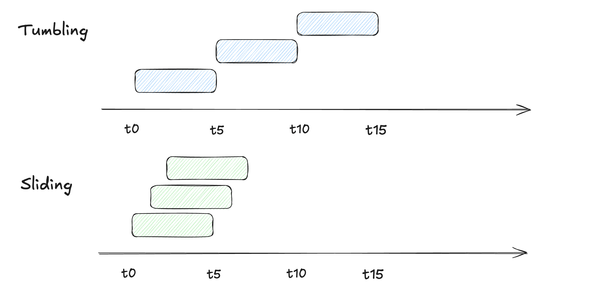
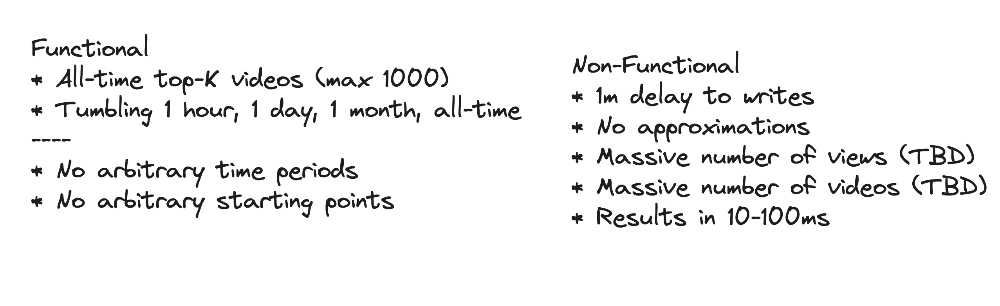

https://www.hellointerview.com/learn/system-design/problem-breakdowns/top-k

# 🎬 Top K Video Finder System Design

## Understanding the Problem

The "Top K Video Finder" is a common system design problem, often framed as finding the top $K$ most viewed or trending videos in a given time window (e.g., last hour, last day). We'll approach this by detailing solutions for beginner, intermediate, and expert levels.

## Requirements
Requirements clarifications are important for all system design problems, but in top-K questions in particular small changes to the requirements can have dramatic impacts on the design. We need to nail down the contract we have with our clients: what do they expect our system to be able to do?

There's two primary types of windows that are used in streaming systems: **sliding windows and tumbling windows**.

- With sliding windows, the last 1 hour is the time between [T-1 hour] and [T]. If our current time is 10:06, the last 1 hour is the time between 9:06 and 10:06.
- With tumbling windows the window for the last hour is the last full hour that starts and ends on an hour boundary. So the time between [Floor(T - 1 hour, 'hour')] and [Floor(T, 'hour')]. If our current time is 10:06, the last 1 hour is the time between 9:00 and 10:00.

### Functional Requirements

- Clients should be able to query the top K videos for all-time (up to a max of 1k results).
- Clients should be able to query tumbling windows of 1 {hour, day, month} and all-time (up to a max of 1k results).

##### Out of scope

- Arbitrary time periods.
- Arbitrary starting/ending points (we'll assume all queries are looking back from the current moment).

### Non-Functional Requirements

- We'll tolerate at most 1 min delay between when a view occurs and when it should be tabulated.
- Our results must be precise, so we should not approximate.
- We should return results within 10's of milliseconds.
- Our system should be able to handle a massive number of views per second.
- We should support a massive number of videos.

## API or System Design

`GET /views/top-k?window={WINDOW}&k={K} -> { videoId: string, views: number }[]`

## 🟢 Level 1: Beginner (Single Server, Basic Aggregation)
This design is suitable for a low-volume system where data fits in memory and the focus is on a single, overall time window (e.g., all-time top 100).

### Core Logic: 

Simplest form of aggregation using in-memory data structures.

### Data Flow:

1. View Events: User views trigger an event.
2. Application Server (Monolithic): A single server receives all view events.
3. Data Structures: The server uses a Hash Map (VideoID -> ViewCount) to store all video counts.

4. Top K Calculation: Periodically, or on request, the server can iterate through the Hash Map, sort the entries, and return the top $K$ results. A Min-Heap (Priority Queue) of size $K$ could be used for more efficient on-the-fly tracking to avoid full sorting, with a time complexity of $O(N \log K)$ where $N$ is the total number of videos.

#### Storage: 

A simple relational or NoSQL database can be used to persist the raw video metadata.

#### Pros: 

Simple, fast for small scale, easy to implement.

#### Cons: 

Not scalable, poor fault tolerance (single point of failure), limited to a single machine's memory, difficult to handle time-based or "trending" results.

## 🟡 Level 2: Intermediate (Distributed Aggregation, Time Windows)

This design scales out the ingestion and aggregation and introduces the concept of different time windows (e.g., hourly, daily top $K$).
### Core Logic: 

Stream processing for near real-time updates and distributed key-value store for fast reads.

### Components:

1. Load Balancer & API Gateway: Distributes incoming view events to ingestion servers.
2. Ingestion Service: Receives view events and writes them to a distributed queue.
3. Message Queue (e.g., Kafka): Handles the high-volume stream of raw view events (VideoID, Timestamp). This decouples the ingestion from processing.
4. Stream Processing Engine (e.g., Flink/Spark Streaming): Consumes the event stream, performs windowed aggregation (e.g., counts per video ID for the last 1 hour, 24 hours), and calculates the current Top $K$ list for each window.
5. Cache/Fast Store (e.g., Redis Sorted Set/ZSET): The stream processor outputs the pre-computed Top $K$ lists for various time windows and categories directly into an ultra-fast data structure like Redis ZSET, which is optimized for rank-based queries.
6. Serving API: Client requests hit this API, which simply fetches the pre-computed, sorted list from the Redis Cache.

### Scalability & Fault Tolerance:

1. Horizontal Scaling: Components like the Stream Processor and Serving API can be scaled horizontally.
2. Persistence: Kafka retains events for replay, aiding fault recovery.
3. Near Real-Time: Updates are reflected within seconds to a few minutes, depending on the stream processor's windowing settings.

## 🔴 Level 3: Expert (Massive Scale, Hybrid Architecture, Approximation)

This design tackles massive scale (billions of events/day), incorporates sophisticated algorithms, and optimizes for both speed and accuracy across diverse time windows and dimensions (e.g., top $K$ by region or genre).

### Core Logic: 

A Hybrid Architecture combining a fast path (stream processing) for trending data and a slow path (batch processing) for long-term accurate data. It also introduces techniques for high-cardinality counting and query flexibility.

### Components & Enhancements:

#### Fast Path (Trending/Real-time):

1. Message Queue (Kafka): Same as intermediate, handles the firehose of events.
2. Stream Processor (Optimized): Uses probabilistic data structures like Count-Min Sketch to estimate counts for massive numbers of videos across different dimensions (e.g., per country, per genre) in memory, saving storage and compute. This handles the 'Heavy Hitters' problem (finding the most frequent items).
3. Materialization: Continuously updates the Redis ZSET cache with approximate Top $K$ lists for short time windows (e.g., 1 minute, 1 hour).

#### Slow Path (Accurate/Historical):

1. Data Lake/Object Store (e.g., S3/HDFS): Raw events from Kafka are archived here for long-term storage and reprocessing.
2. Batch Processor (e.g., Spark Batch): Periodically runs (e.g., every 6 hours) on the complete, archived data to compute exact Top $K$ lists for longer time windows (e.g., all-time, last month). This corrects any potential errors from the fast path.
3. Database (e.g., OLAP DB or Cassandra): Stores the accurate, long-term Top $K$ results.

#### Serving Layer: The Serving API has logic to query:
1. Redis ZSET for fresh, trending, short-window Top $K$.
2. Batch Database for accurate, long-window Top $K$.

#### Advanced Features:

1. Personalization: Candidate generation could be added, using ML models (like Collaborative Filtering or Deep Learning models) to generate a personalized $K$ list for each user, which is then ranked by a final scoring model.
2. Geospatial and Category Partitions: The Stream Processor can partition the data by region or video category before aggregation to compute Top $K$ for specific dimensions efficiently. Consistent Hashing is used to distribute video IDs across stream processor nodes for balanced load.

