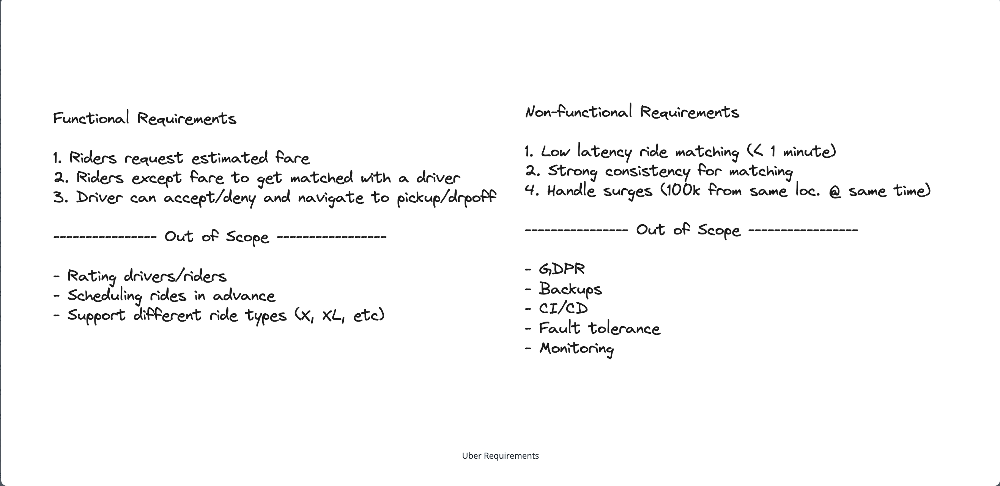
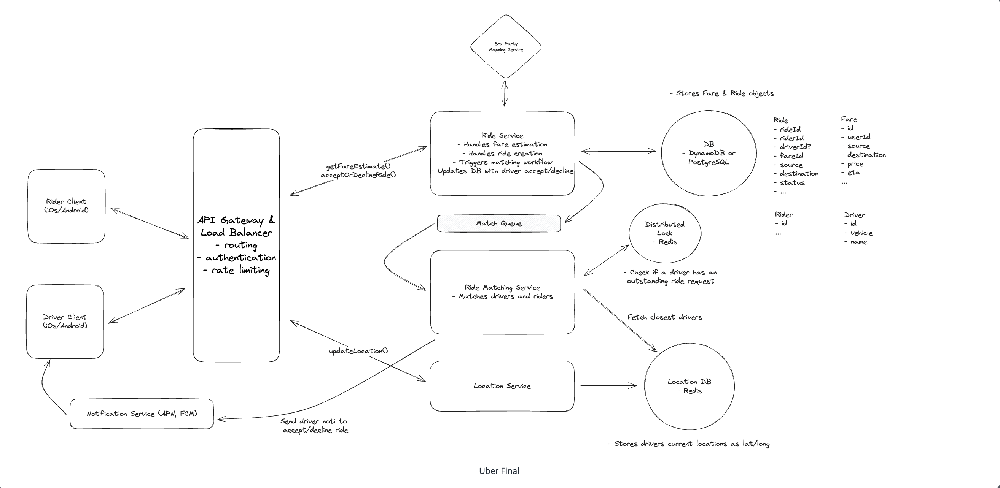

## Uber — System Design Walkthrough

### Goal
Design a large-scale ride-hailing service (like Uber) that supports matching riders with drivers, real-time tracking, fare calculation, and high availability.

### Requirements


### Functional

- Rider can request a ride (pickup, destination).
- Driver can accept/decline requests and update availability.
- Find nearby drivers and match them to rider requests quickly.
- Real-time location updates for driver and rider tracking.
- Fare calculation, trip lifecycle (requested → accepted → en-route → completed → paid).
  
**Out of scope**
- Surge pricing.
- Ride selection
- User and driver profiles, trip history, ratings.

### Non-functional
- Low latency and **consistency** for matching (< 1s for initial shortlist).
- Scalable to millions of users and drivers across regions.
- Secure and consistent handling of sensitive data.

## Core Entities

- **Rider**: This is any user who uses the platform to request rides. It includes personal information such as name and contact details, preferred payment methods for ride transactions, etc.
- **Driver**: This is any users who are registered as drivers on the platform and provide transportation services. It has their personal details, vehicle information (make, model, year, etc.), and preferences, and availability status.
- **Fare**: This entity represents an estimated fare for a ride. It includes the pickup and destination locations, the estimated fare, and the estimated time of arrival. This could also just be put on the ride object, but we'll keep it separate for now but there is no right or wrong answer here.
- **Ride**: This entity represents an individual ride from the moment a rider requests an estimated fare all the way until its completion. It records all pertinent details of the ride, including the identities of the rider and the driver, vehicle details, state, the planned route, the actual fare charged at the end of the trip, and timestamps marking the pickup and drop-off.
- **Location**: This entity stores the real-time location of drivers. It includes the latitude and longitude coordinates, as well as the timestamp of the last update. This entity is crucial for matching riders with nearby drivers and for tracking the progress of a ride.

### Data Modeling
- User: user_id, name, phone, payment_methods, rating, etc.
- Driver: driver_id, name, vehicle_info, status (available/busy), rating, current_location_id, last_active
- Ride: trip_id, rider_id, driver_id, pickup_location, dropoff_location, start_time, end_time, status, fare, route
- Location events: driver_id, timestamp, lat, lon
Indexes:
- Geospatial index on driver locations
- Secondary indexes for driver availability and region

## API or System Interface

**Fair Estimate Endpoint**: The API for retrieving a fare estimate is straightforward. We define a simple POST endpoint that takes in the user's current location and desired destination and returns a Fare object with the estimated fare and eta. We use POST here because we will be creating a new ride object in the database.
```
POST /fare -> Fare
Body: {
  pickupLocation, 
  destination
}
```

**Request Ride Endpoint**: This endpoint is used by riders to confirm their ride request after reviewing the estimated fare. It initiates the ride matching process by signaling the backend to find a suitable driver, thus creating a new ride object.
```
POST /rides -> Ride
Body: {
  fareId
}
```

> Note that at this point in the flow, we match them with a driver who is nearby and available. However, this is all happening in the backend, so we don't need to explicitly list out an endpoint for this.

**Update Driver Location Endpoint**: Before we can do any matching, we need to know where our drivers are. This endpoint is used by drivers to update their location in real-time. It is called periodically by the driver client to ensure that the driver's location is always up to date.
```
POST /drivers/location -> Success/Error
Body: {
        lat, long
    }
```

> Note the `driverId` is present in the session cookie or JWT and not in the body or path params. Always consider the security implications of your API. User data should always be passed in the session or JWT, while timestamps should be generated by the server. Data like fareEstimate should be retrieved from the database and never passed in by the client.

**Accept Ride Request Endpoint**: This endpoint allows drivers to accept a ride request. Upon acceptance, the system updates the ride status and provides the driver with the pickup location coordinates.
```
PATCH /rides/:rideId -> Ride
Body: {
  accept/deny
}
```

The Ride object is would contain information about the pickup location and destination so the client can display this information to the driver.

## High Level Design



1. Driver heartbeats & location updates
	 - Driver app sends location updates periodically (e.g., every 5s) to a Location Ingest service.
	 - Location Ingest publishes to a streaming platform and updates the Geospatial Index (Redis / Geo-based DB).

2. Rider requests a ride
	 - Rider sends request with pickup and destination (lat/long).
	 - **Trip Service** shares estimate fare and ETA.
	 - Rider accepts the fair.
	 - Trip Service validates and persists the ride request, and, in turn, calls the **Matching Service**.

3. Matching
	 - Matching Service queries Geospatial Index for nearby available drivers within radius R and returns a shortlist (k drivers).
	 - Could use various strategies: nearest-first, batch request, multi-criteria (ratings, acceptance rate, ETA, dynamic pricing).
	 - Dispatch either:
		 - Sends requests to drivers sequentially (offers to driver 1 → wait T → driver 2), or
		 - Sends concurrent offers and chooses the first acceptor.
	 - Once a driver accepts, Trip Service updates state and notifies client apps.

4. Trip lifecycle
	 - Driver picks up rider, trip state transitions; Location Service streams updates for ETA calculation and UI.

## Deep Dives

#### Matching Strategies & Algorithms
- Simple radius nearest-neighbor: Use geospatial index (Redis GEO or specialized quad-tree).
- Batched/Multicast offers: choose k nearest and include predicted acceptance probability.
- Skill-based routing: VIP riders get priority; drivers filtered by vehicle type.
- Multi-criteria cost function: combine ETA, acceptance rate, driver rating.

#### Storage Choices
- User/Driver/Trip metadata: relational DB or document store with strong consistency for writes (Postgres or MySQL with shards).
- Geospatial store & hot location data: in-memory store like Redis (GEO commands) or a dedicated geospatial DB (GeoMesa, Elasticsearch).
- Event stream: Kafka for durability and decoupling (location updates, trip events).
- Long-term analytics: data lake (S3) with Parquet for batch processing.

#### Scaling & Sharding
- Partition by geographic region (city, area) to reduce search space and locality of data.
- Use service instances per region for matching and location ingest.
- Shard user/trip data by user_id or region to parallelize writes.
- Autoscale matching service horizontally; maintain leader-election or consistent hashing for routing.

#### Consistency & Concurrency
- Use optimistic locking or state-machine transitions in Trip Service to avoid double-booking.
- Centralize critical state transitions in Trip Service to act as source-of-truth.
- Use idempotent APIs and event-sourcing to replay events during failure recovery.

#### Real-time Considerations
- Compress or throttle location updates from client to balance accuracy vs. cost (adaptive sampling).
- Edge aggregation: do basic filtering or aggregation in gateways before publishing to core systems.
- Use WebSockets or mobile push notifications for low-latency updates to clients.

#### Fault Tolerance & Recovery
- Use retries with exponential backoff for transient failures.
- Design matching to be tolerant to missing drivers (fallback to expanded radius).
- Persistent event logs (Kafka) allow replay for state reconstruction.
- Circuit-breakers around external services (payments, notification).

#### Security and Privacy
- Encrypt sensitive data at rest and in transit.
- Token-based auth for mobile clients (OAuth2/JWT) with refresh tokens.
- Rate-limit and detect anomalous behavior (fraud detection).
- Minimize PII in logs; redact or hash identifiers where possible.

#### Monitoring & Metrics
- Track: request rates, match latency, acceptance rates, trip success/failure, driver availability, ETA accuracy.
- SLOs: 99.9% availability for matching API, median match latency < 1s in cities.
- Alerts on error-rate spikes, lagging Kafka consumers, low driver supply.

#### Cost & Trade-offs
- In-memory geospatial store is faster but more expensive; persistent geospatial DB cheaper but higher latency.
- Precomputing match candidates reduces latency but might use stale data.
- Strong consistency increases complexity and reduces throughput; eventual consistency is acceptable for metrics/analytics but not for trip assignment.

## Interview Questions

### 1. How do we handle frequent driver location updates and efficient proximity searches on location data?

Managing the high volume of location updates from drivers and performing efficient proximity searches to match them with nearby ride requests is a difficult task, and our current high-level design most definitely does not handle this well. There are two main problems with our current design that we need to solve:

**High Frequency of Writes:** Given we have around 10 million drivers, sending locations roughly every 5 seconds, that's about 2 million updates a second! Whether we choose something like DynamoDB or PostgreSQL (both great choices for the rest of the system), either one would either fall over under the write load, or need to be scaled up so much that it becomes prohibitively expensive for most companies.

**Query Efficiency:** Without any optimizations, to query a table based on lat/long we would need to perform a full table scan, calculating the distance between each driver's location and the rider's location. This would be extremely inefficient, especially with millions of drivers. Even with indexing on lat/long columns, traditional B-tree indexes are not well-suited for multi-dimensional data like geographical coordinates, leading to suboptimal query performance for proximity searches. This is essentially a non-starter.

**Solution: Real-time in-memory Geospatial data store**

We can address all the limitation of the previous solutions by using an in-memory data store like Redis, which supports geospatial data types and commands. This allows us to handle real-time driver location updates and proximity searches with high throughput and low latency while minimizing storage costs with automatic data expiration.

`Redis` is an in-memory data store that supports geospatial data types and commands. It uses geohashing to encode latitude and longitude coordinates into a single string key, which is then indexed using a sorted set. This allows for efficient storage and querying of geospatial data.

Redis provides geospatial commands like `GEOADD` for adding location data and `GEOSEARCH` for querying nearby locations within a given radius or bounding box. These commands are highly optimized for geospatial data and can be used to efficiently handle real-time driver location updates and proximity searches. The `GEOSEARCH` command, introduced in Redis 6.2, replaces and enhances the functionality of the older `GEORADIUS` and `GEORADIUSBYMEMBER` commands, offering more flexibility and performance improvements.

We no longer have a need for batch processing since Redis can handle the high volume of location updates in real-time. Additionally, Redis automatically expires data based on a specified time-to-live (TTL), which allows us to retain only the most recent location updates and avoid unnecessary storage costs.

**Challenges**

The main challenge with this approach would be durability. Since Redis is an in-memory data store, there's a risk of data loss in case of a system crash or power failure. However, this risk can be mitigated in a few ways:

1. Redis persistence: We could enable Redis persistence mechanisms like RDB (Redis Database) or AOF (Append-Only File) to periodically save the in-memory data to disk.

2. Redis Sentinel: We could use Redis Sentinel for high availability. Sentinel provides automatic failover if the master node goes down, ensuring that a replica is promoted to master.

Even if we experience data loss due to a system failure, the impact would be minimal. Since driver location updates come in every 5 seconds, we would only need that long to recover and rebuild the state of our system. This quick recovery time ensures that our system remains robust and reliable, even in the face of potential failures.

### 2. How can we manage system overload from frequent driver location updates while ensuring location accuracy?

High-frequency location updates from drivers can lead to system overload, straining server resources and network bandwidth. This overload risks slowing down the system, leading to delayed location updates and potentially impacting user experience. In most candidates original design, they have drivers ping a new location every 5 seconds or so. This follow up question is designed to see if they can intelligently reduce the number of pings while maintaining accuracy.

**Solution: Adaptive Location Update Intervals**

**Approach**

We can address this issue by implementing adaptive location update intervals, which dynamically adjust the frequency of location updates based on contextual factors such as speed, direction of travel, proximity to pending ride requests, and driver status. This allows us to reduce the number of location updates while maintaining accuracy.

The driver's app uses on-device sensors and algorithms to determine the optimal interval for sending location updates. For example, if the driver is stationary or moving slowly, updates can be less frequent. Conversely, if the driver is moving quickly or changing direction often, updates are sent more frequently.

**Challenges**

The main challenge with this approach is the complexity of designing effective algorithms to determine the optimal update frequency. This requires careful consideration and testing to ensure accuracy and reliability. But, if done well, it will significantly reduce the number of location updates and improve system efficiency.

### 3. How do we prevent multiple ride requests from being sent to the same driver simultaneously?

We defined consistency in ride matching as a key non-functional requirement. This means that we only request one driver at a time for a given ride request AND that each driver only receives one ride request at a time. That driver would then have 10 seconds to accept or deny the request before we move on to the next driver if necessary. If you've solved Ticketmaster before, you know this problem well -- as it's almost exactly the same as ensuring that a ticket is only sold once while being reserved for a specific amount of time at checkout.

**Solution: Distributed Lock with TTL**

**Approach**

To solve the timeout issue, we can use a distributed lock implemented with an in-memory data store like Redis. When a ride request is sent to a driver, a lock is created with a unique identifier (e.g., driverId) and a TTL set to the acceptance window duration of 10 seconds. The Ride Matching Service attempts to acquire a lock on the driverId in Redis. If the lock is successfully acquired, it means no other service instance can send a ride request to the same driver until the lock expires or is released. If the driver accepts the ride within the TTL window, the Ride Matching Service updates the ride status to "accepted" in the database, and the lock is released in Redis. If the driver does not accept the ride within the TTL window, the lock in Redis expires automatically. This expiration allows the Ride Matching Service to consider the driver for new ride requests again.

**Challenges**

The main challenge with this approach is the system's reliance on the availability and performance of the in-memory data store for locking. This requires robust monitoring and failover strategies to ensure that the system can recover quickly from failures and that locks are not lost or corrupted. Given locks are only held for 10 seconds, this is a reasonable tradeoff as the ephemerality of the data makes it easier to recover from failures.

### 4. How can we ensure no ride requests are dropped during peak demand periods?

During peak demand periods, the system may receive a high volume of ride requests, which can lead to dropped requests. This is particularly problematic during special events or holidays when demand is high and the system is under stress. We also need to protect against the case where an instance of the Ride Matching Service crashes or is restarted, leading to dropped rides.

**Solution: Queue with Dynamic Scaling**

**Approach**

To address this issue, we can introduce a queueing system with dynamic scaling. When a ride request comes in, it is added to the queue. The Ride Matching Service then processes requests from the queue in a first-come, first-served manner. If the queue grows too large, the system scales horizontally by adding more instances of the Ride Matching Service to handle the increased load. This allows us to scale the system dynamically based on demand, ensuring that no requests are dropped. We can also partition the queues based on geographic regions to further improve efficiency.
We could use a distributed message queue system like Kafka, which allows us to commit the offset of the message in the queue only after we have successfully found a match. This way, if the Ride Matching Service goes down, the match request would still be in the queue, and a new instance of the service would pick it up. This approach ensures that no ride requests are lost due to service failures and provides fault tolerance to our system.

**Challenges**

The main challenge with this approach is the complexity of managing a queueing system. We need to ensure that the queue is scalable, fault-tolerant, and highly available. We can address this by using a managed queueing service like Amazon SQS or Kafka, which provides these capabilities out of the box. This allows us to focus on the business logic of the system without worrying about the underlying infrastructure.

The other issue with this approach is that since it is a FIFO queue you could have requests that are stuck behind a request that is taking a long time to process. This is a common issue with FIFO queues and can be addressed by using a priority queue instead. This allows us to prioritize requests based on factors like driver proximity, driver rating, and other relevant factors. This ensures that the most important requests are processed first, leading to a better user experience.


### 5. What happens if a driver fails to respond in a timely manner?
Our system works great when the drivers either accept or deny the ride request, but what if the drop their phone in the passenger seat and take a break? How do we ensure that the ride request continues to be processed? Ideally we'd want the system to move on to the next driver if the current driver doesn't respond in a timely manner.

**Solution: Durable Execution**

**Approach**

A more robust solution is to use a durable execution framework like Temporal or AWS Step Functions. These systems provide built-in support for timeouts, retries, and state management in a way that survives service crashes and restarts.
With durable execution, the entire ride matching workflow is modeled as a durable workflow that can handle complex business logic, including driver timeouts, retries, and fallback mechanisms. The workflow maintains its state persistently, so even if the service crashes, the workflow can be resumed from where it left off.
For example, a Temporal workflow would:
Send the ride request to the first driver
Set a 10-second timeout
If the driver accepts, complete the workflow
If the driver declines or times out, automatically move to the next driver
Continue this process until a driver is found or all drivers are exhausted
The entire process is fault-tolerant and can handle service failures, network issues, and other disruptions without losing state or dropping ride requests.

**Challenges**

The main challenge with this approach is the additional complexity of introducing a workflow orchestration system. It requires teams to learn new concepts and tools, and adds another component to the system that needs to be monitored and maintained.
However, the benefits of guaranteed execution, built-in fault tolerance, and simplified business logic often outweigh these challenges, especially for mission-critical systems like ride-sharing platforms where dropped requests directly impact revenue and user experience.

### 6. How can you further scale the system to reduce latency and improve throughput?

**Solution: Geo-sharding with Read-replicas** 

**Approach**

A better approach is to scale horizontally by adding more servers. We can do this by sharding our data geographically and using read replicas to improve read throughput. This allows us to scale the system to handle more requests while reducing latency and improving throughput. Importantly, this not only allows us to scale but it reduces latency by reducing the distance between the client and the server. This applies to everything from our services, message queue, to our databases -- all of which can be sharded geographically. The only time that we would need to scatter gather (i.e., query multiple shards) is when we are doing a proximity search on a boundary.

**Challenges**

The main challenge with this approach is the complexity of sharding and managing multiple servers. We need to ensure that data is distributed evenly across shards and that the system can handle failures and rebalancing. We can address this by using consistent hashing to distribute data across shards and by implementing a replication strategy to ensure that data is replicated across multiple servers. This allows us to scale the system horizontally while maintaining fault tolerance and high availability.

## Additional Features (optional)
- Pooling/shared rides: needs route optimization and multi-stop matching.
- Estimated Time of Arrival (ETA) improvements with ML.
- Driver incentives & dynamic pricing models.
- Real-time surge visualization dashboards.

## Interview Tips
- Clarify requirements and constraints (scale, target markets).
- Start with a simple core design (rider requests → nearest driver match), then iterate with scaling and failure scenarios.
- Be explicit about data flows, bottlenecks, and where to add caches or queues.
- Discuss trade-offs and pick measurable SLOs.
