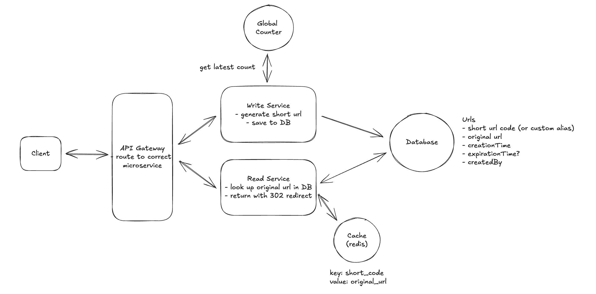

# Designing URL Shortner like Bit.ly

Bit.ly is a URL shortening service that converts long URLs into shorter, manageable links. It also provides analytics for the shortened URLs.

# Requirements


## Functional Requirements

### Core Requirements
- Users should be able to submit a long URL and receive a shortened version.
  - Optionally, users should be able to specify a custom alias for their shortened URL.
  - Optionally, users should be able to specify an expiration date for their shortened URL.

- Users should be able to access the original URL by using the shortened URL.

## Non-Functional Requirements

### Core Requirements
- The system should ensure uniqueness for the short codes (no two long URLs can map to the same short URL)
- The redirection should occur with minimal delay (< 100ms)
- The system should be reliable and available 99.99% of the time (availability > consistency)
- The system should scale to support 1B shortened URLs and 100M DAU

# Core Entities

In a URL shortener, the core entities are very straightforward:

- Original URL: The original long URL that the user wants to shorten.
- Short URL: The shortened URL that the user receives and can share.
- User: Represents the user who created the shortened URL.

# API or System Interface

1. To shorten a URL, we'll need a POST endpoint that takes in the long URL and optionally a custom alias and expiration date, and returns the shortened URL. We use post here because we are creating a new entry in our database mapping the long url to the newly created short url.

```
// Shorten a URL
POST /urls
{
  "long_url": "https://www.example.com/some/very/long/url",
  "custom_alias": "optional_custom_alias",
  "expiration_date": "optional_expiration_date"
}
->
{
  "short_url": "http://short.ly/abc123"
}
```

2. For redirection, we'll need a GET endpoint that takes in the short code and redirects the user to the original long URL. GET is the right verb here because we are reading the existing long url from our database based on the short code.

```
// Redirect to Original URL
GET /{short_code}
-> HTTP 302 Redirect to the original long URL
```

# High-Level Design

## 1) Users should be able to submit a long URL and receive a shortened version

When a user submits a long url, the client sends a POST request to `/urls` with the long url, custom alias, and expiration date. Then:

1. The Primary Server receives the request and validates the long URL. This is to ensure that the URL is valid (there's no point in shortening an invalid URL) and that it doesn't already exist in our system (we don't want collisions).
   - To validate that the URL is valid, we can use popular open-source libraries like `is-url` or write our own simple validation.
   - To check if the URL already exists in our system, we can query our database to see if the long URL is already present.

2. If the URL is valid and doesn't already exist, we can proceed to generate a short URL:
   - For now, we'll abstract this away as some magic function that takes in the long URL and returns a short URL. We'll dive deep into how to generate short URLs in the next section.
   - If the user has specified a custom alias, we can use that as the short code (after validating that it doesn't already exist).

3. Once we have the short URL, we can proceed to insert it into our database, storing the short code (or custom alias), long URL, and expiration date.

4. Finally, we can return the short URL to the client.


## 2) Users should be able to access the original URL by using the shortened URL

When a user accesses a shortened URL, the following process occurs:

1. The user's browser sends a GET request to our server with the short code (e.g., GET /abc123).
2. Our Primary Server receives this request and looks up the short code (abc123) in the database.
3. If the short code is found and hasn't expired (by comparing the current date to the expiration date in the database), the server retrieves the corresponding long URL.
4. The server then sends an HTTP redirect response to the user's browser, instructing it to navigate to the original long URL.

There are two main types of HTTP redirects that we could use for this purpose:

- **301 (Permanent Redirect):** This indicates that the resource has been permanently moved to the target URL. Browsers typically cache this response, meaning subsequent requests for the same short URL might go directly to the long URL, bypassing our server. The response back to the client looks like this:
  ```
  HTTP/1.1 301 Moved Permanently
  Location: https://www.original-long-url.com
  ```

- **302 (Temporary Redirect):** This suggests that the resource is temporarily located at a different URL. Browsers do not cache this response, ensuring that future requests for the short URL will always go through our server first. The response back to the client looks like this:
  ```
  HTTP/1.1 302 Found
  Location: https://www.original-long-url.com
  ```

In either case, the user's browser (the client) will automatically follow the redirect to the original long URL and users will never even know that a redirect happened.
For a URL shortener, a 302 redirect is often preferred because:
- It gives us more control over the redirection process, allowing us to update or expire links as needed.
- It prevents browsers from caching the redirect, which could cause issues if we need to change or delete the short URL in the future.
- It allows us to track click statistics for each short URL (even though this is out of scope for this design).

# Deep Dives / Interview Questions

## 1) How can we ensure short urls are unique?

### Good Solution: Hash Function

**Approach**

We need some entropy (randomness) to try to ensure that our codes are unique. We could try a random number generator or a hash function!
Using a random number generator to create short codes involves generating a random number each time a new URL is shortened. This random number serves as the unique identifier for the URL. We can use common random number generation functions like JavaScript's Math.random() or more robust cryptographic random number generators for increased unpredictability. The generated random number would then be used as the short code for the URL. But a random number generator does not provide enough entropy to ensure that our codes are unique.

So instead, we could use a hash function like SHA-256 to generate a fixed-size hash code. Hash functions take an input and return a deterministic, fixed-size string of characters. Pure hash functions are deterministic: the same long URL always maps to the same short code without needing to query the database. This may be desirable (deduplication) or not (if you need multiple codes per URL or want to prevent guessability/adversarial preimages). For the latter cases, add a secret salt or nonce (HMAC). Hash functions also provide a high degree of entropy, meaning that the output appears random and is unlikely to collide for different inputs.
We can then take the output and encode it using a base62 encoding scheme and then take just the first N characters as our short code. N is determined based on the number of characters needed to minimize collisions. When truncating, be aware of modulo bias—use proper techniques like rejection sampling to avoid skewing the distribution.

Why base62? It's a compact representation of numbers that uses 62 characters (a-z, A-Z, 0-9). The reason it's 62 and not the more common base64 is because we exclude the characters + and / since those are reserved for url encoding.

Let's view a quick example of this in some pseudo code.
```
input_url = "https://www.example.com/some/very/long/url"
# Canonicalize URL first (lowercase host, strip default ports, normalize trailing slash, etc.)
canonical_url = canonicalize(input_url)
hash_code = hash_function(canonical_url)
short_code_encoded = base62_encode(hash_code)
short_code = short_code_encoded[:8] # 8 characters
```

**Challenges**

Despite the randomness, there's still a chance of generating duplicate short codes as the number of stored URLs increases. With a code space of size |S| and n codes already in use, the probability the next randomly generated code collides is n / |S|. At large scale this can become non-negligible, requiring retries and database checks to enforce uniqueness.

To reduce collision probability, we need higher entropy, which means generating longer short codes. However, longer codes negate the benefit of having a short URL. Detecting and resolving collisions also adds database lookups on insertion, introducing latency and complexity. This creates a tradeoff between uniqueness, shortness, and efficiency—making it difficult to optimize all three simultaneously.

To handle collisions, implement a UNIQUE constraint on the short code column and retry with bounded attempts (e.g., max 3-5 retries) before falling back to a different strategy or returning an error. Upon saving to the database, we'll get an error if the short code already exists. In this case, we can simply retry the process with a random salt added to the hash function.

### Great Solution: Unique Counter with Base62 Encoding

**Approach**

One way to guarantee we don't have collisions is to simply increment a counter for each new url. We can then take the output of the counter and encode it using base62 encoding to ensure it's a compacted representation.

Redis is particularly well-suited for managing this counter because it's single-threaded and supports atomic operations. Being single-threaded means Redis processes one command at a time, eliminating race conditions. Its INCR command is atomic, meaning the increment operation is guaranteed to execute completely without interference from other operations. This is crucial for our counter - we need absolute certainty that each URL gets a unique number, with no duplicates or gaps.
Each counter value is unique, eliminating the risk of collisions without the need for additional checks. Incrementing a counter and encoding it is computationally efficient, supporting high throughput. With proper counter management, the system can scale horizontally to handle massive numbers of URLs. The short code can be easily decoded back to the original ID if needed, aiding in database lookups.

**Challenges**

In a distributed environment, maintaining a single global counter can be challenging due to synchronization issues. All instances of our Primary Server would need to agree on the counter value. We'll talk more about this when we get into scaling. We also have to consider that the size of the short code continues to increase over time with this method.

To determine whether we should be concerned about length, we can do a little math. If we have 1B urls, when base62 encoded, this would result in a 6-character string. Here's why:

**1,000,000,000 in base62 is '15ftgG'**

This means that even with a billion URLs, our short codes would still be quite compact. As we approach 62^7 (over 3.5 trillion) URLs, we'd need to move to 7-character codes. This scalability allows us to handle a massive number of URLs while keeping the codes short and effectively neutralizing that concern.

## 2) How can we ensure that redirects are fast?

When dealing with a large database of shortened URLs, finding the right match quickly becomes crucial for a smooth user experience. Without any optimization, our system would need to check every single pair of short and original URLs in the database to find the one we're looking for. This process, known as a "full table scan," can be incredibly slow, especially as the number of URLs grows into the millions or billions.

### Good Solution: Add an Index

### Great Solution: Implementing an In-Memory Cache (e.g., Redis)

To improve redirect speed, we can introduce an in-memory cache like Redis or Memcached between the application server and the database. This cache stores the frequently accessed mappings of short codes to long URLs. When a redirect request comes in, the server first checks the cache. If the short code is found in the cache (a cache hit), the server retrieves the long URL from the cache, significantly reducing latency. If not found (a cache miss), the server queries the database, retrieves the long URL, and then stores it in the cache for future requests.

### Great Solution: Leveraging Content Delivery Networks (CDNs) and Edge Computing

In this approach, the short URL domain is served through a CDN with Points of Presence (PoPs) geographically distributed around the world. The CDN nodes cache the mappings of short codes to long URLs, allowing redirect requests to be handled close to the user's location. Furthermore, by deploying the redirect logic to the edge using platforms like Cloudflare Workers or AWS Lambda@Edge, the redirection can happen directly at the CDN level without reaching the origin server.
The benefit here is that, at least for popular short codes, the redirection can happen at the CDN (close to the user) and it never even reaches our Primary Server, meaningfully reducing the latency.

## 3) How can we scale to support 1B shortened urls and 100M DAU?

**1. Data Size & Storage**

- Each URL entry ≈ 500 bytes (including metadata).
- For 1B URLs → ~500 GB total, easily handled by a single modern SSD.
- If data grows further → shard across multiple database servers.
- Any reliable DB (Postgres, MySQL, DynamoDB) works since writes are low (~1 row/sec). Postgres is a solid default choice.

**2. High Availability**

- Database Replication: Keep multiple DB copies; switch to replicas if the primary fails.

- Backups: Periodically snapshot data to recover from major failures.

**3. Scaling Services**

- Split into two microservices:
  - Read Service: Handles redirects (high read load).

  - Write Service: Handles URL creation (low write load).

- Horizontally scale each independently — add more instances as load grows.

**4. Unique Counter Management**

- Use a centralized Redis for the short code counter:

  - Supports atomic increments (ensures global uniqueness).
  - Extremely fast and single-threaded.

- All Write Service instances fetch the next available counter value from Redis.

**5. Optimizing Redis Load**

- Use counter batching:

  - Each Write Service requests a batch (e.g., 1000 IDs) at once.
  - Uses them locally → reduces Redis calls & latency.

- For durability & HA:

  - Use Redis replication/failover.
  - Periodically persist counter state to durable storage.

**✅ Final Design Summary**

- Caching layer → scales reads.

- Postgres (or similar) → stores URL mappings.

- Redis → manages unique ID generation.

- Microservices (Read/Write) → scale independently.

- Replication + Backups → ensure availability and reliability.

# Final Design

